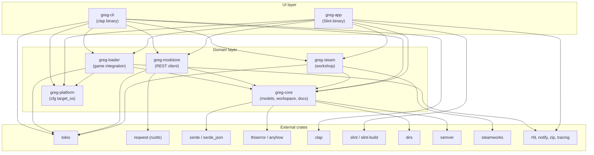

# RUST_GRAPH.md — Rust restart: workspace graph

> **Status:** Workspace implemented on `feat/rust-workspace` (all crates compile,
> `cargo test` green). The C# / Avalonia implementation is frozen under
> `.reference/modmanager-old/`. UI is Slint (`crates/greg-app/ui/`); see
> "Main window" below for the shell layout.

## Target tree

```text
Cargo.toml                  # workspace root (members + shared lints)
crates/
  greg-core/                # domain models, docs/changelog logic, errors — NO UI deps
  greg-steam/               # Steam Workshop via `steamworks` crate
  greg-modstore/            # Modstore REST client
  greg-loader/              # game/MelonLoader discovery, installs, adapters
   greg-platform/            # cfg(target_os) shims (replaces Unix/Windows/MacOs projects)
   greg-app/                 # desktop UI binary (Slint)
   greg-cli/                 # headless publish/status/list binary
xtask/                      # build orchestration (`cargo xtask …`)
```

## Dependency graph



Rules:

- `greg-core` must never depend on UI crates (`slint`) or binaries.
  If a fix seems to need that, stop and ask the maintainer.
- `greg-app` / `greg-cli` are thin shells: composition root + presentation.
  All logic lives in the domain crates.
- Platform code lives in `greg-platform` behind `cfg(target_os)`; game
  adapters live in `greg-loader`.

## External crates (planned)

| Crate | Use | Replaces (C#) |
| --- | --- | --- |
| `slint` / `slint-build` | desktop UI, retained mode, single binary | Avalonia views/viewmodels |
| `tokio` | async runtime (downloads, polling, publish) | `async/await` + callbacks |
| `reqwest` (rustls) | Modstore REST, update checks | `HttpClient` wrappers |
| `serde` / `serde_json` | models, metadata, manifests | `System.Text.Json` + `AppJsonContext` |
| `thiserror` / `anyhow` | typed errors / app-level errors | exceptions + result VMs |
| `clap` (derive) | headless CLI (`publish`, `status`, `list`) | `HeadlessRunner` |
| `dirs` | known paths, workspace roots | `Environment.SpecialFolder` |
| `semver` (official) | version validation/comparison | hand-rolled SemVer |
| `steamworks` | Workshop API (AppID `4170200`) | `Cherry.Facepunch.Steamworks` |
| `rfd` | native file dialogs | Avalonia `StorageProvider` |
| `notify` | workspace file watching | polling fallbacks |
| `zip` | content export/packaging | `System.IO.Compression` |
| `tracing` | structured logs | `AppFileLog` / `AppLogService` |

Keep-a-Changelog section parsing and Markdown→Steam-BBCode conversion are
ported as small internal modules in `greg-core` (logic owned, no dependency).

## C# → Rust mapping

| Archived (C#, `.reference/modmanager-old/`) | New (Rust) |
| --- | --- |
| `GregModmanager.Core` (models + services) | `greg-core` (+ `greg-steam`, `greg-modstore`, `greg-loader`) |
| `GregModmanager.Avalonia` (views, VMs, styles) | `greg-app` (Slint) |
| `GregModmanager.{Unix,Windows,MacOs}` | `greg-platform` (`cfg(target_os)`) |
| `HeadlessRunner` (`--mode publish/status/list`) | `greg-cli` (`clap`) |
| `GregModmanager.Tests` (xUnit) | `cargo test` per crate + integration tests |
| `UploadDependencyChecker`, `WorkspaceService`, `ProjectDocsResolver`, `KeepAChangelogParser`, `MarkdownToSteamBbCode` | port into `greg-core` first (pure logic, no Steam needed) |

## Explicitly NOT ported

MelonLoader plugins must stay .NET 6 (they load inside MelonLoader):
`SubDirectoryFixer` and `gregPlugin.ModmanagerCompanion` remain frozen in
`.reference/modmanager-old/src/GregModmanager.Melons/`. If the Rust app must
build them, it shells out to the `dotnet` CLI via `xtask` — never rewrite
them in Rust.

## Main window (Slint)

Shell layout in `crates/greg-app/ui/main.slint`, grounded in the old Avalonia
`MainWindow`: TerminalCore palette, header with game-start buttons and
login/profile card, full-height 64 px icon bar on the far left with the G logo
as first icon (Modmanager ▤, Workshop Upload ⬆, Modstore ◈, Settings ⚙),
conditional navigation beside it (MODMANAGER: My Mods, My Plugins, My Libs,
Modpacks, Collections, Problems, Report a Bug; WORKSHOP UPLOAD: Projects,
New Project, Browse, Subscribed, Favorited — one shared browse page with a
list switcher, own uploads live in Projects; Modstore and Settings need none
— tabs / single page suffice), content pages, and a bottom status bar with
Steam + GregApi LEDs. Modpacks are local applicable sets (entries carry
`enabled` + optional `local_path`); Collections are the shareable
Steam-like lists (file export/import, `.gregpack.json`).

Gating (enforced in Rust, `AppState::apply_probe`): GregApi red
(unreachable) hides the login button and disables Modstore — only Steam
Workshop remains. Liveness is probed live in the background every 30 s (plus
on demand when heading for the Modstore): `GET {api}/api/v1/mods` must answer
2xx + JSON, otherwise the API shows OFFLINE — redirects, error pages,
timeouts and DNS failures never count as online.

Fixed-geometry rules (the old "misplaced icons" class of bug): icon buttons
are fixed 56×56 with centered glyphs and a 3 px active bar; text buttons use
std-widgets `Button` (auto-sizing — custom rectangles collapse to zero width
in layouts); `Rectangle` uses `background:` (not deprecated `color:`);
Workshop u64 ids travel as strings (Slint `int` is 32-bit). Content pages
stay compact and top-anchored (`alignment: start` on the content wrapper —
the default packs stretch-less content at the end, leaving the void on top).
`vertical-stretch` on fixed-content list containers never grows them
(max-capped) but propagates tallness upward while bare status `Text`s absorb
the free space mid-page — so no vertical stretch on such containers, and no
free space for absorbers. `Rectangle` children fill (no auto preferred size):
overlay cards and menu popups need explicit geometry (fixed heights, e.g.
input rows 36px, menu buttons 32px). `Flickable` reports preferred 0, so it
collapses anywhere without distributed area — `TabWidget` sizes content to
preferred and leaves `Flickable` tabs invisible; use custom tab buttons with
conditional panels instead. Window dragging uses the native
`WindowMoveArea` element and resizing the native border handling
(`resize-border-width`) — both compositor-side and Wayland-safe; manual
`set_position`/`set_size` dragging does not work on Wayland.

## Next steps

- [x] Workspace + `greg-core` with ported pure-logic modules + tests.
- [x] `greg-cli` headless publish against a fixture workspace.
- [x] `greg-steam` (`steamworks` crate) publish/browse behind rate limiter.
- [x] `greg-app` (Slint) shell + editor + upload flow.
- [x] OAuth session flow (`greg://auth/callback` handling, profile menu).
- [x] Gallery screenshots up/download via Steam (upload: second update with
  `AddItemPreviewFile`; download: details query with additional-previews
  flag into `screenshots/` on import — both over `steamworks-sys`, the
  safe 0.13.1 API has no wrappers).
- [x] Rust CI jobs (fmt, clippy, test, cross-build) in `.forgejo/` + `.gitea/`.
