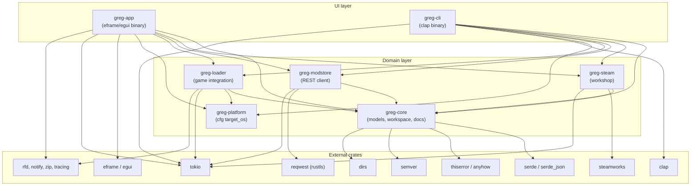

# RUST_GRAPH.md — Rust restart: workspace graph

> **Status:** Planning only, no code yet. The C# / Avalonia implementation is
> frozen under `archive/modmanager-old/`. Docs, changelog, and infomaterial at
> repo root are untouched; only the app language changes (C# → Rust).

## Target tree

```text
Cargo.toml                  # workspace root (members + shared lints)
crates/
  greg-core/                # domain models, docs/changelog logic, errors — NO UI deps
  greg-steam/               # Steam Workshop via `steamworks` crate
  greg-modstore/            # Modstore REST client
  greg-loader/              # game/MelonLoader discovery, installs, adapters
  greg-platform/            # cfg(target_os) shims (replaces Unix/Windows/MacOs projects)
  greg-app/                 # desktop UI binary (eframe/egui)
  greg-cli/                 # headless publish/status/list binary
xtask/                      # build orchestration (`cargo xtask …`)
```

## Dependency graph



Rules:

- `greg-core` must never depend on UI crates (`eframe`/`egui`) or binaries.
  If a fix seems to need that, stop and ask the maintainer.
- `greg-app` / `greg-cli` are thin shells: composition root + presentation.
  All logic lives in the domain crates.
- Platform code lives in `greg-platform` behind `cfg(target_os)`; game
  adapters live in `greg-loader`.

## External crates (planned)

| Crate | Use | Replaces (C#) |
| --- | --- | --- |
| `eframe` / `egui` | desktop UI, immediate mode, single binary | Avalonia views/viewmodels |
| `tokio` | async runtime (downloads, polling, publish) | `async/await` + callbacks |
| `reqwest` (rustls) | Modstore REST, update checks | `HttpClient` wrappers |
| `serde` / `serde_json` | models, metadata, manifests | `System.Text.Json` + `AppJsonContext` |
| `thiserror` / `anyhow` | typed errors / app-level errors | exceptions + result VMs |
| `clap` (derive) | headless CLI (`publish`, `status`, `list`) | `HeadlessRunner` |
| `dirs` | known paths, workspace roots | `Environment.SpecialFolder` |
| `semver` (official) | version validation/comparison | hand-rolled SemVer |
| `steamworks` | Workshop API (AppID `4170200`) | `Cherry.Facepunch.Steamworks` |
| `rfd` | native file dialogs | Avalonia `StorageProvider` |
| `notify` | workspace file watching | polling fallbacks |
| `zip` | content export/packaging | `System.IO.Compression` |
| `tracing` | structured logs | `AppFileLog` / `AppLogService` |

Keep-a-Changelog section parsing and Markdown→Steam-BBCode conversion are
ported as small internal modules in `greg-core` (logic owned, no dependency).

## C# → Rust mapping

| Archived (C#) | New (Rust) |
| --- | --- |
| `GregModmanager.Core` (models + services) | `greg-core` (+ `greg-steam`, `greg-modstore`, `greg-loader`) |
| `GregModmanager.Avalonia` (views, VMs, styles) | `greg-app` (`eframe`/`egui`) |
| `GregModmanager.{Unix,Windows,MacOs}` | `greg-platform` (`cfg(target_os)`) |
| `HeadlessRunner` (`--mode publish/status/list`) | `greg-cli` (`clap`) |
| `GregModmanager.Tests` (xUnit) | `cargo test` per crate + integration tests |
| `UploadDependencyChecker`, `WorkspaceService`, `ProjectDocsResolver`, `KeepAChangelogParser`, `MarkdownToSteamBbCode` | port into `greg-core` first (pure logic, no Steam needed) |

## Explicitly NOT ported

MelonLoader plugins must stay .NET 6 (they load inside MelonLoader):
`SubDirectoryFixer` and `gregPlugin.ModmanagerCompanion` remain frozen in
`archive/modmanager-old/src/GregModmanager.Melons/`. If the Rust app must
build them, it shells out to the `dotnet` CLI via `xtask` — never rewrite
them in Rust.

## Next steps (not started)

1. `cargo new` workspace + `greg-core` with ported pure-logic modules + tests.
2. `greg-cli` headless publish against a fixture workspace.
3. `greg-steam` (`steamworks` crate) publish/browse behind rate limiter.
4. `greg-app` (`eframe`) editor + upload flow.
5. Rust CI jobs (fmt, clippy, test, cross-build) in `.forgejo/` + `.gitea/`.
